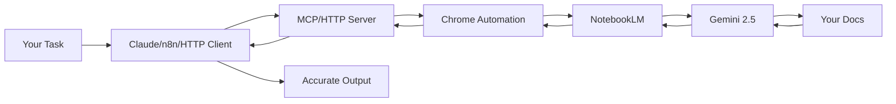

<div align="center">

# NotebookLM MCP Server

**Chat directly with NotebookLM for zero-hallucination answers based on your own notebooks**

[](https://www.typescriptlang.org/)
[](https://modelcontextprotocol.io/)
[](https://www.npmjs.com/package/notebooklm-mcp)
[](https://github.com/PleasePrompto/notebooklm-skill)
[](https://github.com/PleasePrompto/notebooklm-mcp)

[MCP Installation](#mcp-installation) • [HTTP REST API](#http-rest-api) • [Why NotebookLM](#why-notebooklm-not-local-rag) • [Examples](#real-world-example) • [Documentation](./deployment/docs/)

</div>

---

## 🚀 Two Ways to Use This Server

### 1️⃣ **HTTP REST API** (New! Recommended for n8n, Zapier, Make.com)

Use NotebookLM from **any tool** via HTTP REST API:

```bash
# Install and start HTTP server
npm install
npm run build
npm run start:http

# Query NotebookLM via REST
curl -X POST http://localhost:3000/ask \
  -H "Content-Type: application/json" \
  -d '{"question": "Explain X", "notebook_id": "my-notebook"}'
```

**Perfect for:**
- ✅ n8n workflows and automation
- ✅ Zapier, Make.com integrations
- ✅ Custom web applications
- ✅ Backend APIs

**👉 Full HTTP setup guide:** [deployment/docs/01-INSTALL.md](./deployment/docs/01-INSTALL.md)

---

### 2️⃣ **MCP stdio** (For Claude Code, Cursor, Codex)

Use NotebookLM directly from your AI coding assistant:

```bash
# Claude Code
claude mcp add notebooklm npx notebooklm-mcp@latest

# Codex
codex mcp add notebooklm -- npx notebooklm-mcp@latest

# Cursor (add to ~/.cursor/mcp.json)
{
  "mcpServers": {
    "notebooklm": {
      "command": "npx",
      "args": ["-y", "notebooklm-mcp@latest"]
    }
  }
}
```

**Perfect for:**
- ✅ Claude Code, Cursor, Codex
- ✅ Any MCP-compatible AI assistant
- ✅ Direct CLI integration

---

## The Problem

When you tell Claude Code or Cursor to "search through my local documentation", here's what happens:
- **Massive token consumption**: Searching through documentation means reading multiple files repeatedly
- **Inaccurate retrieval**: Searches for keywords, misses context and connections between docs
- **Hallucinations**: When it can't find something, it invents plausible-sounding APIs
- **Expensive & slow**: Each question requires re-reading multiple files

## The Solution

Let your tools chat directly with [**NotebookLM**](https://notebooklm.google/) — Google's **zero-hallucination knowledge base** powered by Gemini 2.5 that provides intelligent, synthesized answers from your docs.

```
Your Task → Agent/n8n asks NotebookLM → Gemini synthesizes answer → Correct output
```

**The real advantage**: No more manual copy-paste. Your agent/workflow asks NotebookLM directly and gets answers back. Build deep understanding through automatic follow-ups.

---

## Why NotebookLM, Not Local RAG?

| Approach | Token Cost | Setup Time | Hallucinations | Answer Quality |
|----------|------------|------------|----------------|----------------|
| **Feed docs to Claude** | 🔴 Very high (multiple file reads) | Instant | Yes - fills gaps | Variable retrieval |
| **Web search** | 🟡 Medium | Instant | High - unreliable sources | Hit or miss |
| **Local RAG** | 🟡 Medium-High | Hours (embeddings, chunking) | Medium - retrieval gaps | Depends on setup |
| **NotebookLM MCP** | 🟢 Minimal | 5 minutes | **Zero** - refuses if unknown | Expert synthesis |

### What Makes NotebookLM Superior?

1. **Pre-processed by Gemini**: Upload docs once, get instant expert knowledge
2. **Natural language Q&A**: Not just retrieval — actual understanding and synthesis
3. **Multi-source correlation**: Connects information across 50+ documents
4. **Citation-backed**: Every answer includes source references
5. **No infrastructure**: No vector DBs, embeddings, or chunking strategies needed

---

## HTTP REST API

### Quick Start

```powershell
# 1. Clone and install
git clone <repo-url> D:\notebooklm-http
cd D:\notebooklm-http
npm install
npm run build

# 2. Configure authentication (one-time)
npm run setup-auth
# Chrome opens → log in with Google → close Chrome

# 3. Add your first notebook
npm run start:http
# In another terminal:
curl -X POST http://localhost:3000/notebooks \
  -H "Content-Type: application/json" \
  -d '{
    "url": "https://notebooklm.google.com/notebook/YOUR-NOTEBOOK-ID",
    "name": "My Knowledge Base",
    "description": "My documentation",
    "topics": ["docs", "api"]
  }'

# 4. Query NotebookLM
curl -X POST http://localhost:3000/ask \
  -H "Content-Type: application/json" \
  -d '{"question": "Explain X"}'

# 5. Validate installation (optional)
.\deployment\scripts\test-server.ps1
```

**👉 See [Testing Guide](./deployment/scripts/README.md) for automated test suite**

### API Endpoints

| Method | Endpoint | Description |
|--------|----------|-------------|
| `GET` | `/health` | Check server health |
| `POST` | `/ask` | Ask a question to NotebookLM |
| `GET` | `/notebooks` | List all notebooks |
| `POST` | `/notebooks` | Add notebook (with live validation) |
| `DELETE` | `/notebooks/:id` | Remove a notebook |
| `PUT` | `/notebooks/:id/activate` | Set active notebook |
| `GET` | `/sessions` | List active sessions |
| `DELETE` | `/sessions/:id` | Close a session |

**👉 Full API documentation:** [deployment/docs/03-API.md](./deployment/docs/03-API.md)

### n8n Integration

Perfect for n8n workflows:

```json
{
  "nodes": [
    {
      "name": "Ask NotebookLM",
      "type": "n8n-nodes-base.httpRequest",
      "parameters": {
        "method": "POST",
        "url": "http://your-server:3000/ask",
        "jsonParameters": true,
        "bodyParametersJson": {
          "question": "{{ $json.query }}",
          "notebook_id": "my-notebook"
        }
      }
    }
  ]
}
```

**👉 n8n guide:** [deployment/docs/04-N8N-INTEGRATION.md](./deployment/docs/04-N8N-INTEGRATION.md)

### Installation & Documentation

- 📖 [**Installation Guide**](./deployment/docs/01-INSTALL.md) — Step-by-step setup
- 🔧 [**Configuration**](./deployment/docs/02-CONFIGURATION.md) — Environment variables, security
- 📡 [**API Reference**](./deployment/docs/03-API.md) — Complete endpoint documentation
- 📚 [**Notebook Library**](./deployment/docs/06-NOTEBOOK-LIBRARY.md) — Multi-notebook management
- ✅ [**Testing Suite**](./deployment/scripts/README.md) — Automated validation scripts
- 🐛 [**Troubleshooting**](./deployment/docs/05-TROUBLESHOOTING.md) — Common issues

---

## MCP Installation

<details>
<summary>Claude Code</summary>

```bash
claude mcp add notebooklm npx notebooklm-mcp@latest
```
</details>

<details>
<summary>Codex</summary>

```bash
codex mcp add notebooklm -- npx notebooklm-mcp@latest
```
</details>

<details>
<summary>Gemini</summary>

```bash
gemini mcp add notebooklm npx notebooklm-mcp@latest
```
</details>

<details>
<summary>Cursor</summary>

Add to `~/.cursor/mcp.json`:
```json
{
  "mcpServers": {
    "notebooklm": {
      "command": "npx",
      "args": ["-y", "notebooklm-mcp@latest"]
    }
  }
}
```
</details>

<details>
<summary>amp</summary>

```bash
amp mcp add notebooklm -- npx notebooklm-mcp@latest
```
</details>

<details>
<summary>VS Code</summary>

```bash
code --add-mcp '{"name":"notebooklm","command":"npx","args":["notebooklm-mcp@latest"]}'
```
</details>

<details>
<summary>Other MCP clients</summary>

**Generic MCP config:**
```json
{
  "mcpServers": {
    "notebooklm": {
      "command": "npx",
      "args": ["notebooklm-mcp@latest"]
    }
  }
}
```
</details>

### MCP Quick Start

1. **Install** the MCP server (see above)

2. **Authenticate** (one-time)

Say in your chat (Claude/Codex):
```
"Log me in to NotebookLM"
```
*A Chrome window opens → log in with Google*

3. **Create your knowledge base**

Go to [notebooklm.google.com](https://notebooklm.google.com) → Create notebook → Upload your docs:
- 📄 PDFs, Google Docs, markdown files
- 🔗 Websites, GitHub repos
- 🎥 YouTube videos
- 📚 Multiple sources per notebook

Share: **⚙️ Share → Anyone with link → Copy**

4. **Let Claude use it**

```
"I'm building with [library]. Here's my NotebookLM: [link]"
```

**That's it.** Claude now asks NotebookLM whatever it needs, building expertise before writing code.

---

## Alternative: Claude Code Skill

**Prefer Claude Code Skills over MCP?** This server is now also available as a native Claude Code Skill with a simpler setup:

**[NotebookLM Claude Code Skill](https://github.com/PleasePrompto/notebooklm-skill)** - Clone to `~/.claude/skills` and start using immediately

**Key differences:**
- **MCP Server** (this repo): Persistent sessions, works with Claude Code, Codex, Cursor, and other MCP clients
- **HTTP REST API** (this repo): Works with n8n, Zapier, Make.com, any HTTP client
- **Claude Code Skill**: Simpler setup, Python-based, stateless queries, works only with local Claude Code

All use the same browser automation technology and provide zero-hallucination answers from your NotebookLM notebooks.

---

## Real-World Example

### Building an n8n Workflow Without Hallucinations

**Challenge**: n8n's API is new — Claude hallucinates node names and functions.

**Solution**:
1. Downloaded complete n8n documentation → merged into manageable chunks
2. Uploaded to NotebookLM
3. Told Claude: *"Build me a Gmail spam filter workflow. Use this NotebookLM: [link]"*

**Watch the AI-to-AI conversation:**

```
Claude → "How does Gmail integration work in n8n?"
NotebookLM → "Use Gmail Trigger with polling, or Gmail node with Get Many..."

Claude → "How to decode base64 email body?"
NotebookLM → "Body is base64url encoded in payload.parts, use Function node..."

Claude → "How to parse OpenAI response as JSON?"
NotebookLM → "Set responseFormat to json, use {{ $json.spam }} in IF node..."

Claude → "What about error handling if the API fails?"
NotebookLM → "Use Error Trigger node with Continue On Fail enabled..."

Claude → ✅ "Here's your complete workflow JSON..."
```

**Result**: Perfect workflow on first try. No debugging hallucinated APIs.

---

## Core Features

### **Zero Hallucinations**
NotebookLM refuses to answer if information isn't in your docs. No invented APIs.

### **Multi-Notebook Library**
Manage multiple NotebookLM notebooks with automatic validation, duplicate detection, and smart selection.

### **Autonomous Research**
Claude asks follow-up questions automatically, building complete understanding before coding.

### **Deep, Iterative Research**
- Claude automatically asks follow-up questions to build complete understanding
- Each answer triggers deeper questions until Claude has all the details
- Example: For n8n workflow, Claude asked multiple sequential questions about Gmail integration, error handling, and data transformation

### **HTTP REST API**
Use NotebookLM from n8n, Zapier, Make.com, or any HTTP client. No MCP required.

### **Cross-Tool Sharing**
Set up once, use everywhere. Claude Code, Codex, Cursor, n8n — all can access the same library.

---

## Architecture



---

## Common Commands (MCP Mode)

| Intent | Say | Result |
|--------|-----|--------|
| Authenticate | *"Open NotebookLM auth setup"* or *"Log me in to NotebookLM"* | Chrome opens for login |
| Add notebook | *"Add [link] to library"* | Saves notebook with metadata |
| List notebooks | *"Show our notebooks"* | Lists all saved notebooks |
| Research first | *"Research this in NotebookLM before coding"* | Multi-question session |
| Select notebook | *"Use the React notebook"* | Sets active notebook |
| Update notebook | *"Update notebook tags"* | Modify metadata |
| Remove notebook | *"Remove [notebook] from library"* | Deletes from library |
| View browser | *"Show me the browser"* | Watch live NotebookLM chat |
| Fix auth | *"Repair NotebookLM authentication"* | Clears and re-authenticates |
| Switch account | *"Re-authenticate with different Google account"* | Changes account |
| Clean restart | *"Run NotebookLM cleanup"* | Removes all data for fresh start |

---

## Comparison to Alternatives

### vs. Downloading docs locally
- **You**: Download docs → Claude: "search through these files"
- **Problem**: Claude reads thousands of files → massive token usage, often misses connections
- **NotebookLM**: Pre-indexed by Gemini, semantic understanding across all docs

### vs. Web search
- **You**: "Research X online"
- **Problem**: Outdated info, hallucinated examples, unreliable sources
- **NotebookLM**: Only your trusted docs, always current, with citations

### vs. Local RAG setup
- **You**: Set up embeddings, vector DB, chunking strategy, retrieval pipeline
- **Problem**: Hours of setup, tuning retrieval, still gets "creative" with gaps
- **NotebookLM**: Upload docs → done. Google handles everything.

---

## FAQ

**Is it really zero hallucinations?**
Yes. NotebookLM is specifically designed to only answer from uploaded sources. If it doesn't know, it says so.

**What about rate limits?**
Free tier has daily query limits per Google account. Quick account switching supported for continued research.

**How secure is this?**
Chrome runs locally. Your credentials never leave your machine. Use a dedicated Google account if concerned.

**Can I see what's happening?**
Yes! Say *"Show me the browser"* (MCP mode) or set `HEADLESS=false` (HTTP mode) to watch the live NotebookLM conversation.

**What makes this better than Claude's built-in knowledge?**
Your docs are always current. No training cutoff. No hallucinations. Perfect for new libraries, internal APIs, or fast-moving projects.

---

## The Bottom Line

**Without NotebookLM**: Write code → Find it's wrong → Debug hallucinated APIs → Repeat

**With NotebookLM**: Research first → Write correct code → Ship faster

Stop debugging hallucinations. Start shipping accurate code.

---

## Disclaimer

This tool automates browser interactions with NotebookLM to make your workflow more efficient. However, a few friendly reminders:

**About browser automation:**
While I've built in humanization features (realistic typing speeds, natural delays, mouse movements) to make the automation behave more naturally, I can't guarantee Google won't detect or flag automated usage. I recommend using a dedicated Google account for automation rather than your primary account—think of it like web scraping: probably fine, but better safe than sorry!

**About CLI tools and AI agents:**
CLI tools like Claude Code, Codex, and similar AI-powered assistants are incredibly powerful, but they can make mistakes. Please use them with care and awareness:
- Always review changes before committing or deploying
- Test in safe environments first
- Keep backups of important work
- Remember: AI agents are assistants, not infallible oracles

I built this tool for myself because I was tired of the copy-paste dance between NotebookLM and my editor. I'm sharing it in the hope it helps others too, but I can't take responsibility for any issues, data loss, or account problems that might occur. Use at your own discretion and judgment.

That said, if you run into problems or have questions, feel free to open an issue on GitHub. I'm happy to help troubleshoot!

---

## Contributing

Found a bug? Have a feature idea? [Open an issue](https://github.com/PleasePrompto/notebooklm-mcp/issues) or submit a PR!

See [CONTRIBUTING.md](./CONTRIBUTING.md) for contribution guidelines.

## License

MIT — Use freely in your projects.

See [LICENSE](./LICENSE) for details.

---

<div align="center">

Built with frustration about hallucinated APIs, powered by Google's NotebookLM

⭐ [Star on GitHub](https://github.com/PleasePrompto/notebooklm-mcp) if this saves you debugging time!

</div>
